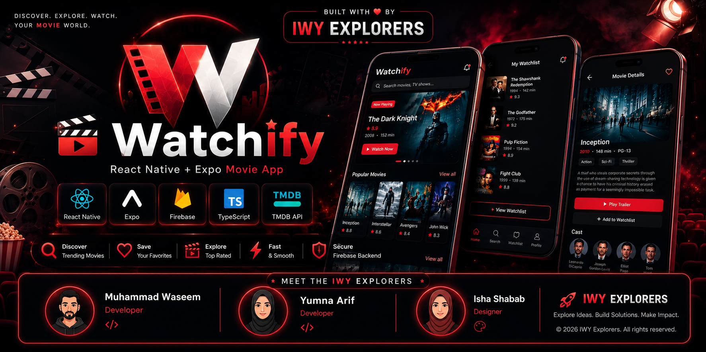

<p align="center">
  
</p>


<p align="center">
  
</p>

<p align="center">


</p>

<p align="center">
  
  
  
  
  
</p>

# 🎬 Watchify – React Native Movie App

Watchify is a modern **React Native + Expo** movie browsing application that allows users to explore trending movies, search films, and manage favorites in a clean and responsive UI.

---

## 🚀 Features

* 🎥 Browse trending and popular movies
* 🔍 Search movies by name
* ❤️ Add/remove favorites (real-time support if connected to backend)
* 📱 Clean and responsive mobile UI
* ⚡ Fast performance with React Native + Expo
* 🔗 API integration for movie data

---

## 🛠️ Tech Stack

<p align="center">
  
</p>

* React Native
* Expo
* TypeScript
* Tailwind CSS (NativeWind)
* Axios (API calls)
* Firebase (authentication, database, and backend services)

---

## 📁 Project Structure

```
Watchify-react-native-app/
│
├── app/                # App screens (routing)
├── components/        # Reusable UI components
├── constants/         # App constants (icons, config)
├── context/           # Global state management
├── services/          # API calls (movies, backend)
├── interfaces/        # TypeScript types
├── assets/            # Images & icons
├── .expo/             # Expo config (ignored in git)
├── App.tsx            # Entry point
└── package.json
```

---

## ⚙️ Installation & Setup

### 1. Clone the repository

```bash
git clone https://github.com/Waseem-Muhammad/Watchify.git
cd Watchify-react-native-app
```

### 2. Install dependencies

```bash
npm install
```

### 3. Start development server

```bash
npx expo start
```

---

## 🔐 Environment Variables

Create a `.env` file in the root directory:

```env
EXPO_PUBLIC_MOVIE_API_KEY=your_tmdb_api_key

EXPO_PUBLIC_FIREBASE_API_KEY=your_firebase_api_key
EXPO_PUBLIC_FIREBASE_AUTH_DOMAIN=your_project.firebaseapp.com
EXPO_PUBLIC_FIREBASE_DATABASE_URL=your_database_url
EXPO_PUBLIC_FIREBASE_PROJECT_ID=your_project_id
EXPO_PUBLIC_FIREBASE_STORAGE_BUCKET=your_storage_bucket
EXPO_PUBLIC_FIREBASE_MESSAGING_SENDER_ID=your_sender_id
EXPO_PUBLIC_FIREBASE_APP_ID=your_app_id
```

⚠️ Do NOT commit `.env` to GitHub.

---

## 📦 APK Download

You can download and install the latest Android APK of Watchify here:

👉 **Download APK:** ([Click here to download APK File](https://expo.dev/accounts/mwaseemgc/projects/react-native-movie-app/builds/7a26d020-f1a7-4225-a371-d077d0b60546))


> After downloading, enable "Install from unknown sources" on your Android device.

---

## 🔨 Build APK

Using EAS:

```bash
eas build -p android
```

For clean build:

```bash
eas build -p android --clear-cache
```
---

## 🧠 Future Improvements

- Firebase Authentication
- Cloud sync for favorites
- Offline mode support
- Video streaming integration
- Dark/light theme toggle
- Push notifications
---

## 👩‍💻 Developed By

### IWY Explorers

- Muhammad Waseem
- Yumna Arif
- Isha Shabab

GitHub: [Muhammad Waseem](https://github.com/Waseem-Muhammad)

GitHub: [Yumna Arif](https://github.com/Yumna-Arif)

GitHub: [Isha Shabab](https://github.com/Ishashabab)

---

## 📸 Screenshots

- [🚀 Opening Screen](./assets/images/opening%20screen.jpeg)
- [🏠 Home Screen](./assets/images/home%20screen.jpeg)
- [🔍 Search Screen](./assets/images/search%20screen.jpeg)
- [🎬 Movie Details](./assets/images/movie%20details.jpeg)
- [❤️ Saved Movies](./assets/images/saved%20screen.jpeg)
- [📱 App Icon](./assets/images/app.jpeg)
---

## 🤝 Contributing

Contributions, issues, and feature requests are welcome.

1. Fork the repository
2. Create a new branch
3. Commit your changes
4. Push to your branch
5. Open a Pull Request

---

## 🔒 Security Notice

This project uses environment variables for API keys and Firebase configuration.

Make sure to create your own `.env` file and never expose secret keys publicly.

---

## 📱 Platform Support

- Android ✅
- Web ✅

---

## ⚠️ Disclaimer

This project is developed by IWY Explorers for educational and portfolio purposes only.

Movie data is provided by TMDB API. All movie posters, titles, and related content belong to their respective owners.

---

## 🙌 Acknowledgements

- TMDB API
- Expo
- React Native
- Firebase

---
## ⭐ Show Support

If you like this project, consider giving it a ⭐ on GitHub!

---

## ❓ FAQ

### Is the APK safe?
Yes, the APK is generated using Expo EAS Build.

### Which API is used?
TMDB API.

---

<p align="center">
  Made with ❤️ by IWY Explorers
</p>
